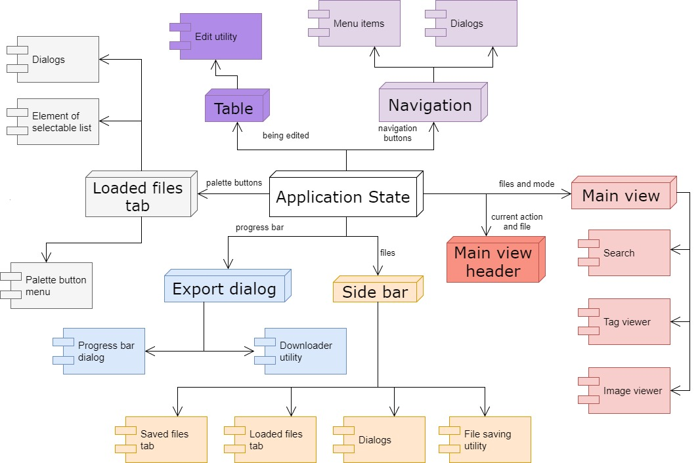
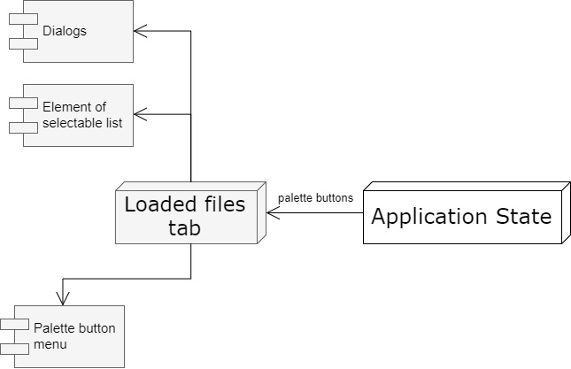
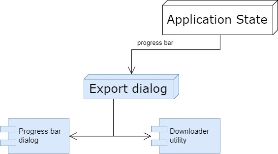
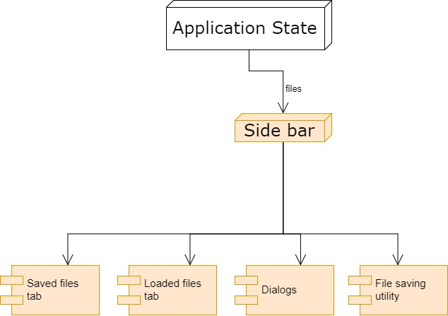
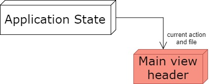
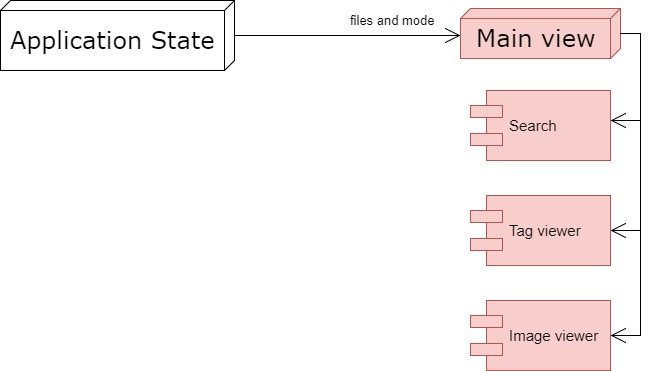
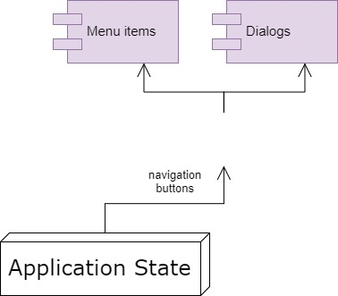
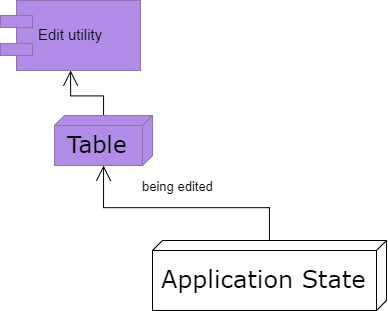

# **Architecture**
DICOM Viewer is a progressive web application, developed using typescript and react.js. The basic architecture of our application is composed of a server side that hosts all DICOM data that need to be stored, and a client side where the entirety of the application's business logic is implemented. Since the server's only purpose is simple data storage, most of this chapter is devoted to the client.

## Client
The client side of our application renders the website using ReactDOM. The architecture of the website is composed of several smaller components. At the core of our application lies an application state reducer, which contains and manages the general state of the application. Different components of the website are subscribed to said reducer, and are notified whenever an important change happens within the application state. When a component is updated and a value in its own internal state changes, it is re-rendered using the new data. 

The top-level component is the _App_, inside which all the other components are nested. The _App_ represents the basic layout of our website, as well as the navigation bar. The different items of the main navigation bar are represented by the _MainView_ and _SideBar_ components. These are wrapped in a _DropZone_ component that handles drag&drop events. The _MainView_ enables switching between tag view and image view, each handled by their respective components: _[TagViewer](./Architecture/Client/TagViewer.md)_ and _[ImageViewer](./Architecture/Client/ImageViewer.md)_. The _[SideBar](./Architecture/Client/Side-bar.md)_ allows for browsing the recently loaded files, viewing all the currently loaded files, selecting up to 2 files for comparison, exporting and/or saving multiple files. 

## *Loaded files tab*
Loaded files tab is subscribed to changes to palette buttons, which can change when user select different option such as compare or export options. 
- Child element palette menu button receives option to be rendered as default option every time user selects a different option.
- Files in this tab are represented as Element of selectable list which has option to be checked and/or used for some action(export, comparing...).
- Dialogs are static question with two option which do not change but listen to certain events in application

## *Export dialog*
Export dialog is subscribed to export progress to be able to show how many files were already exported.
- progress bar show how many files were exported out of all files
- downloaded utility takes care of downloading files as excel, png or dcm format, if multiple files are to be downloaded, files are zipped before download

## *[Side bar](./Architecture/Client/Side-bar.md)*

Side bar is subscribed to multiple files such as currently loaded files, selected files, recent files and saved files.
- Saved files tab consists of 2 indexDB's - recent and saved 
- Loaded files tab has all currently loaded files, currently viewed file and all selected files 
- Dialogs used to confirm deletion, overwrite of database files and so on
- File saving utility uses File Forage library to store loaded files and selected files to indexDB

## *Main view header* 
Main view header is subscribed to information in state to indicate what is currently being shown. For example viewing in basic mode, search mode or comparison mode and which file/files are currently shown.

## *Main view*
Main view is subscribed to loaded files, selected files and current file and flag that represents whether comparison mode is active and flag that represents which tab is selected
- Search component is a simple text field which upon pressing enter or button sets Application state with search criteria. Criteria is then distributed to table to filter table data
- Tag viewer is a component that is responsible for viewing and modifying table data and contains other components like search bar and side bar

## *Navigation*
Navigation is mirror component to side bar and thus provides same functionality with no differences

## *Table*
Table represents multiple tables in our application(e.g. simple and hierarchical table), these tables are used to show loaded data or to modify existing file
- Edit utility component modifies how table is shown and allows to modify each row of table separately
