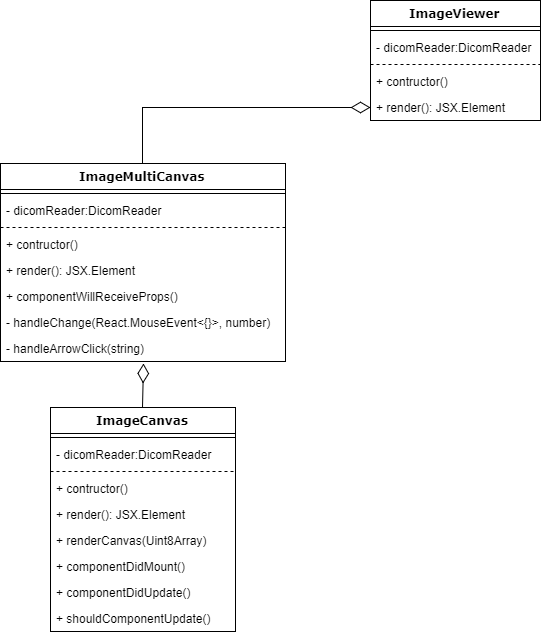

The ImageViewer component receives an array buffer (Uint8Array) containing raw pixel data of a dicom image, whether in single-frame or multi-frame format, and renders the image or series of images on the screen. The raw data, and the number of frames within it, is passed down to the ImageMultiCanvas component. This component, depending on the data it received, renders a single frame, or a series of frames that the user can browse through. The rendering of a single frame is handled by the ImageCanvas class. The overview of this architecture can be seen in the class diagram below:

