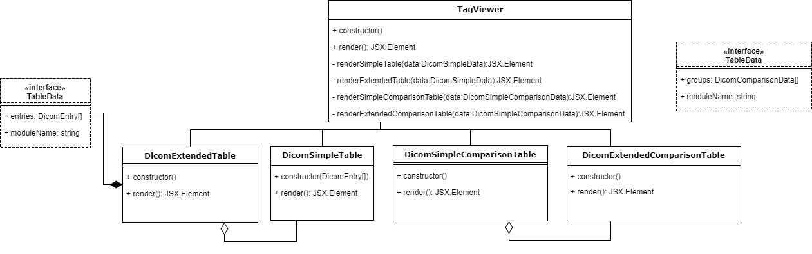

The TagViewer component is responsible for displaying the loaded dicom data in table form. It receives data from the application state through its props, containing the following information:
- currentFile: HeavyweightFile  -  file currently selected for viewing
- files: SelectedFile[]  -  the list of files selected for comparison
- tableMode: TableMode  -  whether the data should be shown in a simple or hierarchical table
- comparisonActive  -  whether to show tags from the current file only (false), or compare tags from all selected files (true)

The JSX components representing each type of table are created using their corresponding classes: 
- DicomSimpleTable - receives an array of DicomEntry objects, and renders a simple table
- DicomExtendedTable - receives an object of type DicomExtendedData, and renders a hierarchical table, where entries are grouped by module name
- DicomSimpleComparisonTable - receives an array of DicomComparisonData objects, and renders a simple table with data from both selected files, their differences highlighted by colour
- DicomExtendedComparisonTable - receives an object of type DicomExtendedComparisonData, and renders a hierarchical table with data from both selected files, and their differences

The render method of the class renders a JSX component returned by the corresponding class. Before the JSX component creation is called, the data is pre-processed into the correct interface format. The extended table classes both transform the data they receive into their private TableData interface form, before feeding the data to the simple tables. The architecture of the tag viewer and its related classes can be seen in the diagram below:

