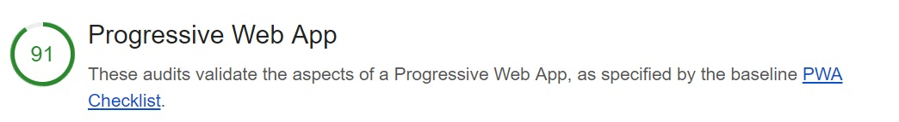
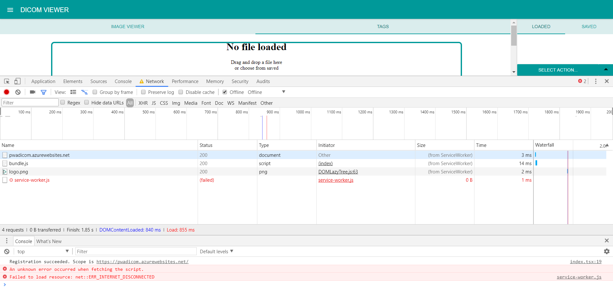

# **Progressive web application of dicom viewer**

Application Dicom viewer is a progressive web application so it can be fully used offline.

### Result of audit by lighthouse.

PWA is implemented by a service worker, implemented in file _**src/service-worker.js**_. This file contains functions **_activate, fetch_** and **_install_**, which provide services for storing the application shell and static assets to cache. It fulfills all the aspects of progressive web app defined by lighthouse audit, except for fast loading on 3G.

### Add to homescreen test
Application was tested on Android devices and it worked as expected. It can be added to home screen and fully used as a mobile application even without internet connection.

## Issues
### Errors in console
Application is working offline and online, but there are some errors logged in browser console.

With application set to _**Offline**_,  we can refresh the page and continue to see site content, even though nothing is coming from the network. After switching to the _**Network panel**_  we can notice in the **_size column_**  that resources are coming from **_Service Worker_**. That's the signal that tells us the Service Worker intercepted the request, and served a response from the cache instead of hitting the network (retrieved from [https://codelabs.developers.google.com/codelabs/debugging-service-workers/index.html#4]()).

You may notice there are failed requests (like for a new _**service-worker.js**_). That's totally fine and expected (retrieved from [https://codelabs.developers.google.com/codelabs/debugging-service-workers/index.html#4]()).

