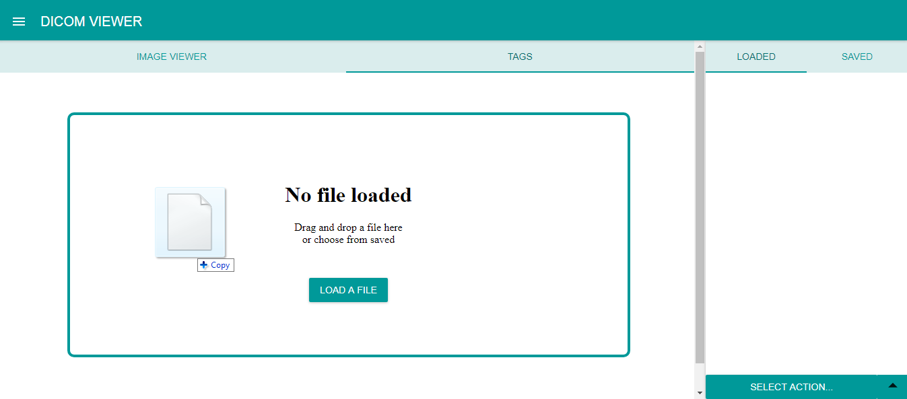
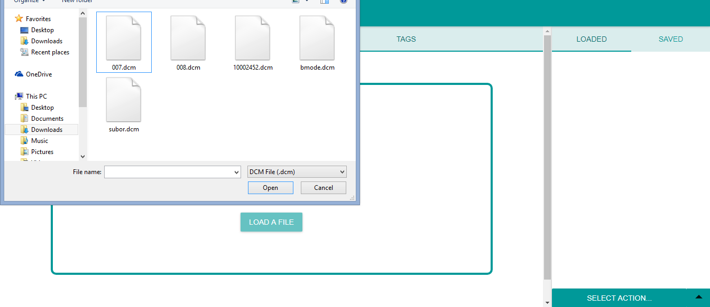
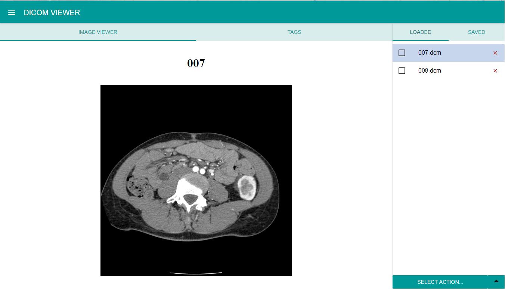
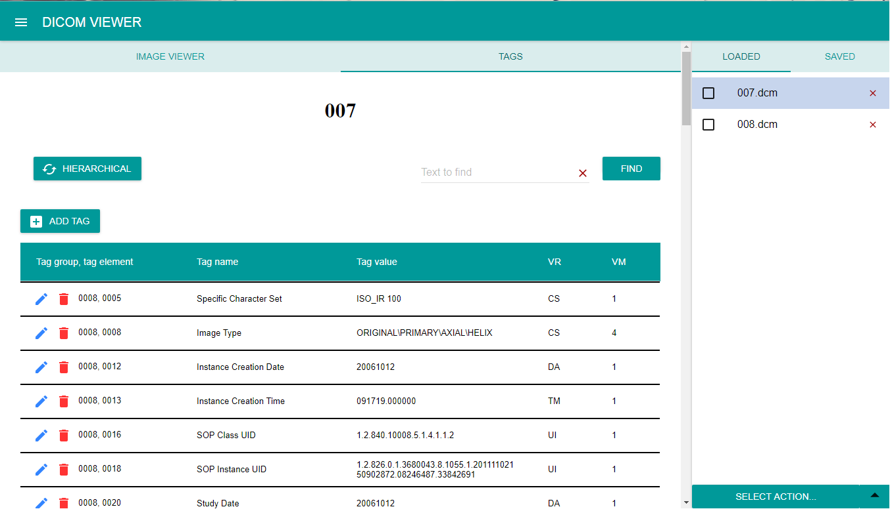
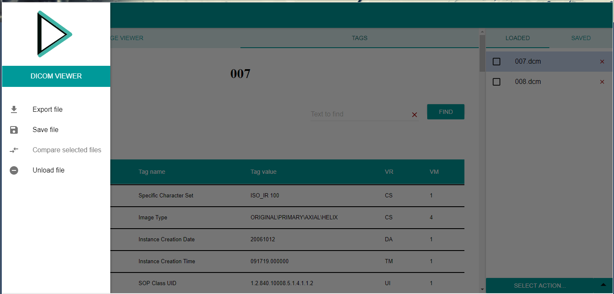

Dicom Viewer allows loading, viewing, comparing, exporting and editing **_dicom files._**
Any non-DICOM format files are not supported and the application will not show any information. 

## **Loading files**

Files can be loaded either by _dragging and dropping_ file into the application

or by clicking LOAD A FILE button and choosing files, if no files have been loaded.

Multiple files can be loaded at once.

Loaded files are listed in the [LOADED](./Usage/Components/Loaded.md) tab.

## **Viewing images**
Image viewer provides a visualization of the currently opened loaded file’s image. Image viewer tab supports single-frame and multi-frame images. 
To show the image click on [IMAGE VIEWER](./Usage/Components/Image-viewer.md) tab.

## **Viewing tags**
Tags of the currently selected loaded file can be displayed by clicking on the [TAGS](./Usage/Components/Tags.md) tab.
The tags are displayed in table where each row represents one tag.
The application provides two different views: simple and hierarchical.
In the simple view, all tags are listed and ordered by the tag group and tag element.
In the hierarchical view, the modules according to the file’s modality are displayed, and tags are grouped to these. 

## **Searching in tags**
There is a simple search in the [TAGS](./Usage/Components/Tags.md) tab, which allows to search, or filter, tags in accordance to the tag's group, element, name and value.

## **Editing files**
Dicom viewer supports editing files. Tags in the file can be edited, removed or added. All these functions are available directly in the [TAGS](./Usage/Components/Tags) tab. (For more information click [here](./Usage/Components/Tags.md).)

## **Other features**
The bottom menu in the [LOADED](./Usage/Components/Loaded.md) tab, as well as the left application menu, provides more functions of Dicom Viewer, such as comparing two dicom files, storing files in the application, exporting files. These are described in [File actions](./Usage/File-actions.md)

