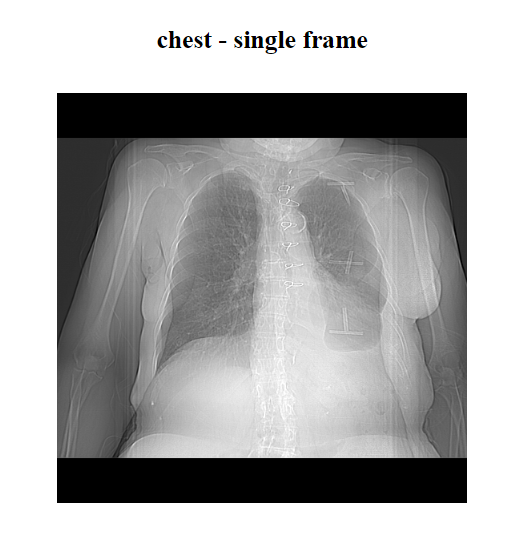
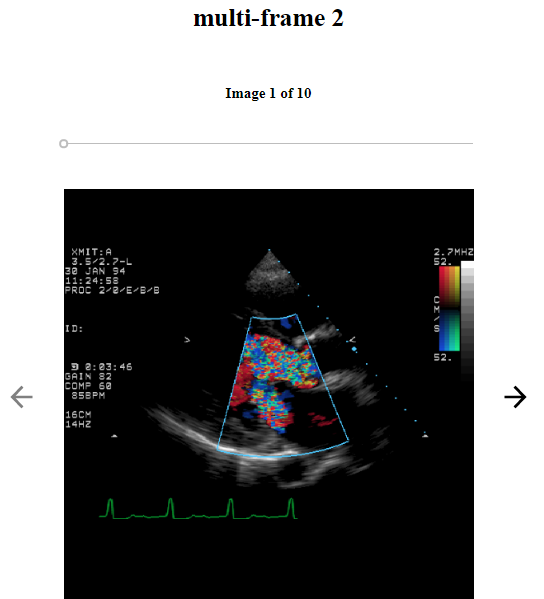

Dicom Viewer contains an image viewer, which provides a visualization of the currently opened loaded file's image.  Image viewer supports both, single and multi frame images.

# **Single frame image**

# **Multi frame image**

If the dicom file contains more than one image, arrows are displayed with which the user can switch between each images. A slider and a header with the number of images is displayed as well.

Slider changes the position based on the currently displayed image and can be controlled by arrows on keyboard.

