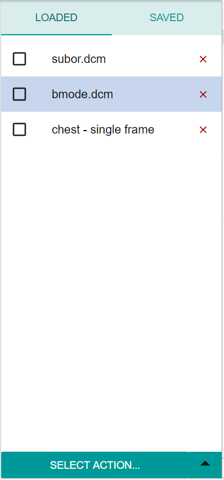
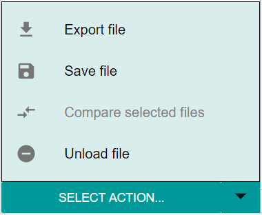

The _'Loaded'_ window shows all files that are currently loaded in the application's memory. The currently previewed file is highlighted in light grey.

- Clicking on a file's name sets that file as current, for the purposes of viewing its tags and image, or performing a [file action](../File-actions.md) over it
- Clicking the checkbox to the left of a file selects that file for further [actions](../File-actions.md)
- Clicking on a file to set it as current deselects all files, if any are selected
- The red 'X' button to the right of the file's name handles file deletion
- The _'Select action...'_ button at the bottom shows a list of actions to perform over the selected files. If no files are selected, actions are performed over the current file only

