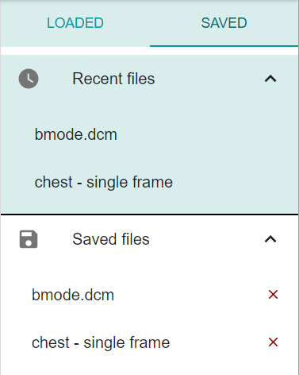

The Saved window shows all files that the user has manually saved in the application's database. It is located in the sidebar on the right side of the screen and accessible by clicking on the Saved tab.
 

- The bottom list titled _'Saved files'_ contains all the files that have been saved throughout the application's local history
- The upper list titled _'Recent files'_ shows only the five most recently saved files for quick reference
- Clicking on a file in either list loads that file from the database and sets it as current
- Clicking on the red 'X' button next to a file in the 'Saved files' list deletes that file from the database (but leaves the application's immediate state unaffected)
