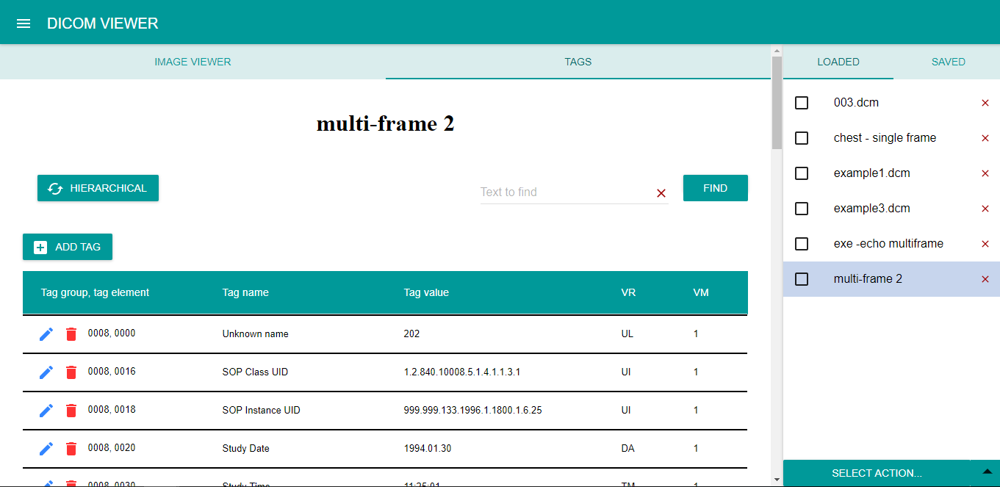
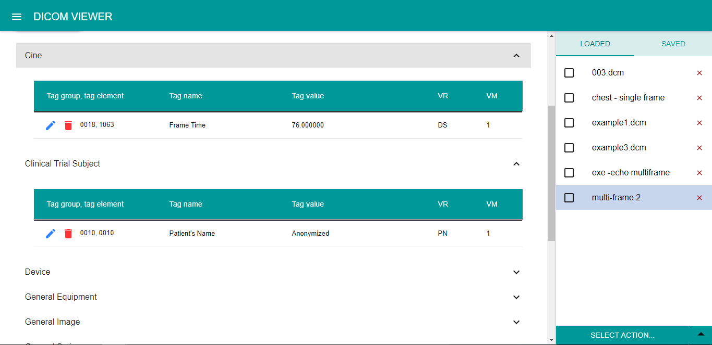
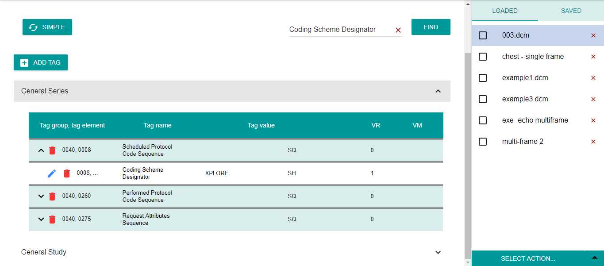
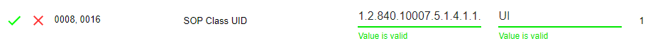
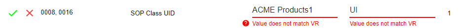
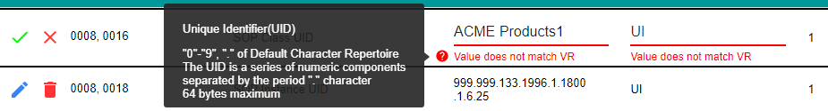
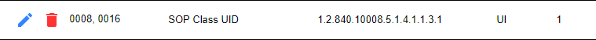
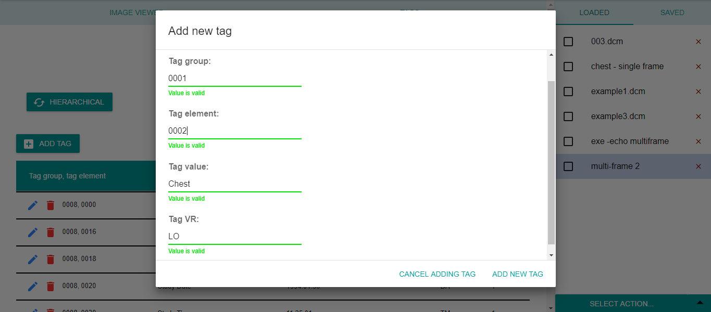
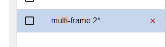

# **Viewing tags** 

Dicom Viewer displays tags contained in the currently selected loaded file.
The tags are displayed in table as following: 
tag group, tag element, tag name, value, value representation (VR) and value multiplicity (VM).
The value name is generated by the application’s internal dictionary corresponding to the dicom standard, therefore custom tags have unknown name.

Application offers simple and hierarchical view. In order to switch between those two views, click HIERARCHICAL (or SIMPLE) button.
### **Simple** - show all tags
In the simple view, all tags are listed and ordered by the tag group and tag element.

### **Hierarchical** - show tags dependent on SOP class
In the hierarchical view, the modules according to the file’s modality are displayed, and tags are grouped to these. Tags in a module can be viewed by clicking on the module.

Sequences are collapsed by default in both views.

# **Search**

User can search based on the tag's:
-  group 
- element 
- name 
- value

Search can be canceled by clicking the red cross and can be confirmed by hitting enter or clicking on FIND button.

Application allows searching in simple and hierarchical mode, also in sequences.

### **Simple**

### **Hierarchical** 

# **Editing file**
Dicom Viewer allows to edit a file.
Tags can be:

1. edited
2. removed
3. added
### 1. Editing tags
A tag can be edited by clicking on the pencil at the beginning of the tag. 
Editing is automatically validated. If everything has right format, value is green/valid.

Else it is red/invalid.

 
The value has to match VR and vice-versa; the question mark under the line provides info about the acceptable format.  If the user moves their mouse over the question mark, they can see the info.

 
The change can be discarded by clicking the red X, or saved either by pressing enter or by clicking the green check-mark.
Tags within sequences can be edited, as well.

### 2. Removing tags
A tag can be removed by clicking on the bin at the beginning of the tag. By clicking on the bin at a sequence (SQ) tag, the whole sequence with its sub-tags is removed.

### 3. Adding tags
A tag can be added by clicking on the ADD TAGS button (right above the table) and filling the required fields. 

All new tags are shown at the bottom of the table. The tag is added to the dicom file near similar tags. (Dicom Viewer doesn’t provide this functionality within sequences.)
If everything has right format, value is green/valid.
 

If a file has been changed, an asterisk is shown by its name in the loaded files tab. All changes in not-saved files are lost after a refresh.

 

The changes are applied to the dicom file after saving the file into the application (by clicking SAVE button).

