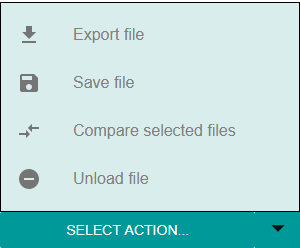

Several actions can be performed over one currently opened loaded file or multiple currently selected files. Files can be selected via the [LOADED](./Components/Loaded.md) tab of the sidebar on the right, and actions can be accessed and performed either from the _Loaded_ tab's  _'Select action...'_ button, or the _Navigation_ component in the upper left part of the screen. Available actions are as follows:

## **[1. Export selected files](./File-actions/Export.md)**
This option allows the user to export all selected files in the form of a dicom file, an image (or a series of images, in case of a multiframe file) or an excel spreadsheet. 

## **[2. Save selected files](./File-actions/Saving-files.md)**
The Save action stores the selected files in the local application's index database. These files will be remembered even after they are replaced, edited or removed from the list of loaded files.

## **[3. Compare selected files](./File-actions/Comparing-files.md)** 
This action enables the tag viewer's comparison mode, showing differences between two files. Selecting this option is enabled only if exactly 2 files are selected. 

## **4. Unload selected files**
This option, as its name implies, does nothing other than remove the selected files from the list of loaded files. No other parts of the application are affected. A single file can be unloaded by clicking the red X at file's name in the [LOADED](./Components/Loaded.md) tab.