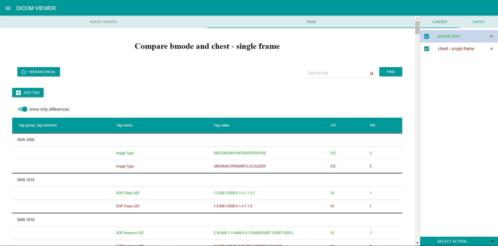

Two DICOM files can be compared following these steps:
1. Load at least 2 files
2. Select two files from the _Loaded_  tab by checking their respective check boxes
3. Select the 'Compare' option from the list of options in the bottom menu in the [LOADED](../Components/Loaded.md) tab

The tag viewer now shows a table with compared data. Each file is assigned a different color, as can be seen in the loaded files list.
Different values are shown in their files' corresponding colors to highlight the differences, and same values are shown in black color.

Example:
#

By default, only differences are shown. To view the common tags turn off the **_Show only differences_** option. Common tags are printed in black color. 

#

The compared files can be viewed either in simple or in hierarchical view.

When comparing two files, image viewer is disabled.

The file comparison can be exited by clicking on a file in the [LOADED](../Components/Loaded.md) tab, by unchecking one of the files, or when one of the compared files is unloaded.

