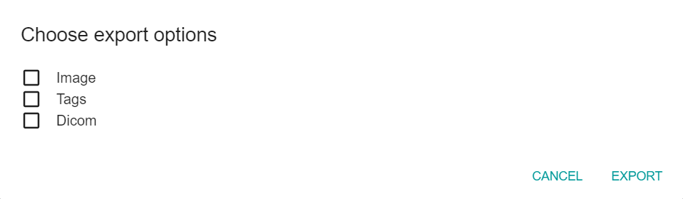

Dicom Viewer provides an export option, which downloads the file and stores it to the default download folder of the device. It is possible to export multiple files.
Selecting export option from the bottom menu of [LOADED](../Components/Loaded.md) tab, or left application menu, opens the following dialog window: 

As shown in the dialog, there are three export options: image, tags or dicom. 
Use the checkboxes to determine in which format the files are downloaded:
- **Image** - a _.png_ image, or a zip archive of _.png_ images
- **Tags** - an _.xlsx_ file containing the same table data as the ones seen in the [TAGS](../Components/Tags.md) component
- **Dicom** - a _.dcm_ file
In case of exporting multiple files, or a single file in multiple formats, all output files are compressed into a zip archive before being offered for download. Clicking on the export button on the bottom right side of the dialog window instantly downloads the file(s).