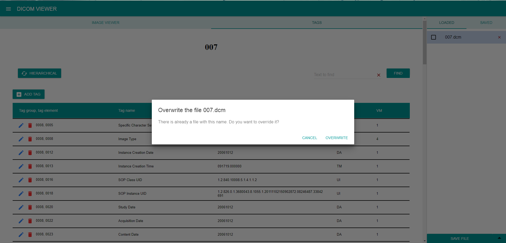

Dicom Viewer allows to store files in the application. To do so, click **_SAVE FILE_** button either in the bottom menu of the loaded files tab or in the left menu. 
The files saved in the application may be retrieved after the application restart and are remembered even after they are replaced, edited or removed from the list of loaded files. The list of saved files together with the 5 most recently opened can be found in [SAVED](../Components/Saved.md) tab in the right file menu; files are alphabetically ordered. 
Files must have unique names, when being saved, otherwise the currently saved file of such name can be either rewritten, or not saved at all, which is decided in the following dialog:
#
A file can be removed from the application by clicking the red X next to the file name in the [SAVED](../Components/Saved.md) tab in the bottom menu. (Removing a file affects only the application's inner storage).
